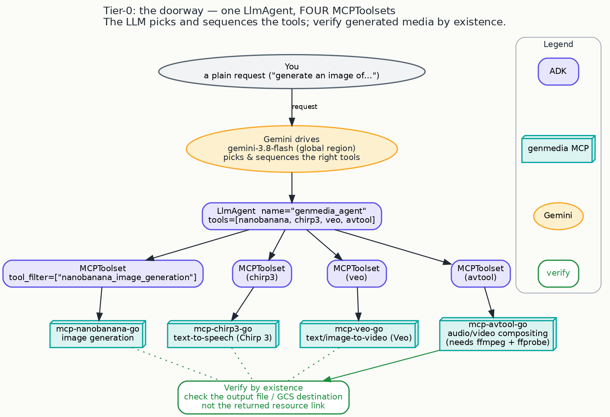

<!-- Hero illustration is a known gap for this Tier-0 post (cycle 7): deferred to the credentialed
     render channel. No placeholder committed. The post ships with its architecture diagram below. -->

# Meet your studio: one agent that can reach for every creative tool

Before the photographer, before the film director, before the whole creative crew, there's a doorway:
the simplest possible version of the idea this series is built on. One agent, a handful of creative
tools, and a plain-language request. You ask for an image, a voiceover, or a short video, and the
agent reaches for the right tool and makes it.

This is the refreshed **Tier-0 sample**, the literal front door to everything that follows. It has no
persona and no pipeline yet. It's the raw material: a model wired to a set of generative-media tools,
so you can see exactly what an "agent" is before the later posts give it a job and a personality.

> The outcome you get: a single running agent that can generate images, speech, and video from a
> sentence, using the same best-in-class tools the rest of the series builds on.

## What this is, stripped to essentials

An agent here is two things and nothing more: a **model** that reasons about your request, and a **set
of tools** it's allowed to call. The model reads what you asked for, decides which tool fits, calls it,
and reports back. That's the whole shape.

The doorway sample wires four creative tools onto one agent:

- **Images**, via nanobanana.
- **Speech**, via Chirp 3 text-to-speech.
- **Video**, via Veo.
- **Compositing**, via an audio/video tool that stitches media together (this one needs `ffmpeg` on
  your machine).

Ask for "an image of a red bicycle against a blue wall" and the model picks the image tool. Ask it to
"say this line as a warm voiceover" and it picks the speech tool. You don't route anything by hand; the
model does the choosing.

## Look how little it takes

The entire agent is one object with a list of tools:

```python
# One agent, four genmedia tools. The model picks and sequences them.
nanobanana = MCPToolset(..., tool_filter=["nanobanana_image_generation"])  # images
chirp3     = MCPToolset(...)   # text-to-speech (Chirp 3)
veo        = MCPToolset(...)   # text/image-to-video (Veo)
avtool     = MCPToolset(...)   # audio/video compositing (needs ffmpeg/ffprobe)

root_agent = LlmAgent(
    model="gemini-3.8-flash",             # runs in the global region
    name="genmedia_agent",
    instruction="You're a creative assistant that can help users with creating audio, images, and video…",
    tools=[nanobanana, chirp3, veo, avtool],
)
```

*(Condensed from the shipped [`adk/genmedia_agent/agent.py`](https://github.com/GoogleCloudPlatform/genmedia-creative-studio/blob/main/experiments/mcp-genmedia/sample-agents/adk/genmedia_agent/agent.py). Each tool is an `MCPToolset`, a small connector to one of the genmedia servers. Those servers run as ordinary binaries on your `PATH`, so there are no extra processes for you to start.)*



## The one idea: an agent is a model plus tools

Everything in the rest of this series is a variation on this one sentence. A **specialist** (the
Photoshoot) is this doorway narrowed to a single tool and given a point of view. A **pipeline** (the
Scriptwriter & Storyboarder) is two of these handing work to each other. A **studio** (the creative
director) is a whole set of them, composed together. So it's worth meeting the plain version once: a
model, a list of tools, and the freedom for the model to choose.

Two small details in the code are worth noticing, because they recur everywhere later:

- The image tool is wired with a **`tool_filter`**, so the agent is handed exactly one capability from
  that server (image generation) rather than everything it offers. Giving an agent a tight, deliberate
  toolset is a habit the specialist posts lean on hard.
- The model is **`gemini-3.8-flash`**, and it's served in the **`global`** region, which is why the
  setup below sets `GOOGLE_CLOUD_LOCATION="global"`.

## Try it

The doorway shares the same one-time setup as every later post (full checklist in the [series
overview](00-overview.md)). The short version:

```bash
cp genmedia_agent/.env.example genmedia_agent/.env   # fill in your project + bucket
uv sync
source .venv/bin/activate
adk web                   # pick "genmedia_agent"
```

You'll need the **genmedia MCP tool suite (≥ v3.18.1)** installed on your `PATH` and **`ffmpeg` /
`ffprobe`** for the compositing tool. The `.env` holds four settings: your Google Cloud project, the
`"global"` location, `GOOGLE_GENAI_USE_VERTEXAI="True"`, and a `GENMEDIA_BUCKET` for cloud output.

Then open the web UI and ask for something:

> Generate an image of a red bicycle leaning against a blue wall.

The agent calls the image tool and reports where the result landed.

## Why you can trust what comes back

The doorway introduces the single habit that runs through the entire series: **verify by existence**. A
tool reporting "success" and handing back a link is not proof that a file was saved. So the way to
confirm any generated asset is to look for the file itself, on disk or in your cloud bucket, rather than
trusting the returned resource link. Every later agent inherits this discipline and makes it automatic;
here you do it yourself, once, so you know what "done" really means.

One note on the backend: this sample is pinned to the **Vertex AI / Google Cloud** backend on purpose
(the dependency is declared as `google-adk[gcp,mcp]`), so it stays consistent with the genmedia servers,
which all assume a Google Cloud configuration.

## See also

- **[The series overview](00-overview.md)** — the full crawl→walk→run map, and the one-time setup
  checklist this doorway shares with every agent that follows.

## Next

Now give the doorway a point of view. The first specialist takes this same shape, narrows it to a
single tool, and turns it into a collaborator with taste: **[The Photoshoot: your first creative
collaborator](crawl-01-photoshoot.md)**. A sentence goes in; an art-directed, on-brand image comes out.

---

<sub>Grounded on merged PR **#1811** (merge commit `b952bf44` on `main`; content verified against the
shipped tree at `sample-agents/adk/`). PR-0 rewired this sample from a stale Imagen path to nanobanana
and corrected its README. Code is condensed for reading; the full wiring (the four stdio `MCPToolset`
connections, their timeouts, and the agent instruction) is in
[`adk/genmedia_agent/agent.py`](https://github.com/GoogleCloudPlatform/genmedia-creative-studio/blob/main/experiments/mcp-genmedia/sample-agents/adk/genmedia_agent/agent.py).
The model (`gemini-3.8-flash`, `global` region), the four toolsets, the `nanobanana` `tool_filter`, the
`google-adk[gcp,mcp]` backend pin, and the `.env` settings are source-verified against the shipped
`agent.py`, `pyproject.toml`, and `.env.example`. Verify-by-existence is the sample's own stated
guidance. Diagram: `blog/diagrams/tier0-doorway.dot`. Visual identity: `blog/graphic-theme.md`.</sub>
